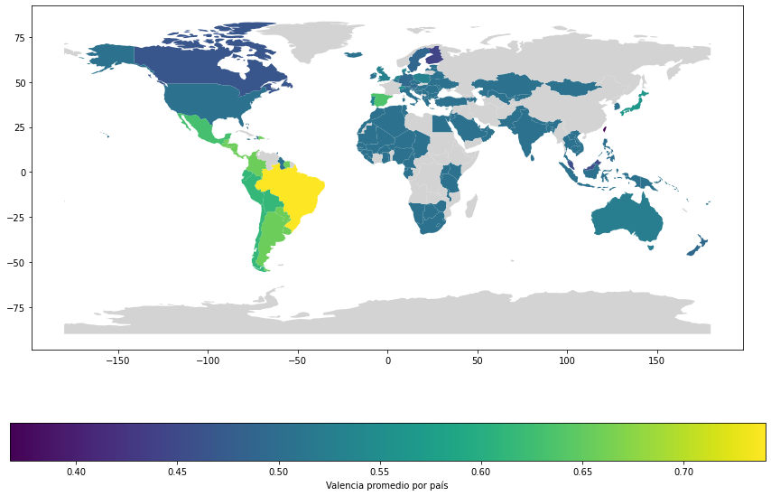

# Geospatial Spotify  
(In development)  

In spanish: Average valence per hit song (where valence is Spotify's way to measure happiness)
## Index
- [Summary](#introduccion)
- [Links](#links)
- [Extra: La música y el mundo, o **un mapa vale más que mil palabras**](#geografia)
  * [Geopandas](#geopandas)

## Summary  
Everybody wants to analyze Spotify. And everybody should do it.  
Given the role that music plays in our life and how Spotify has positioned itself as our go-to service to fullfil this quasi-sacred everyday ritual, when presented with the posibility of getting insights from this massive dataset, one could feel stumped and even get lost wandering between the endless posibilities. As for myself, my initial thoughts (citing the notebook) where:
>
    ¿Las regiones reflejaran un mejor de vida en la felicidad que consumen a través de canciones?
    ¿Nos seguirá gustando bailar incluso en épocas donde asistir a un antro es considerado terror biólogico? Y si es así, ¿A quiénes nos gusta bailar más?

 And with this as a starting point, we (you are now part of the work) are going to create a dataset from scratch (well, getting a lot of help from Spotify's API), of the 50 top hits per country, and perform some initial geospatial analysis with it. This is an extremely early work, but it's good enough for the curious eye to learn a few new concepts in a real environment. Enjoy it.  
 
 Access the notebook through the file or directly in [colab](https://colab.research.google.com/drive/1YMSnIwXacq0136SFCc_3Wt1jWYubMSqu#scrollTo=XWge66jIwqoI)
## Links  
- [Spotify for Developers](https://developer.spotify.com/documentation/web-api/)
- [Spotipy](https://spotipy.readthedocs.io/en/2.17.1/)
- [geopandas](https://geopandas.org/)

